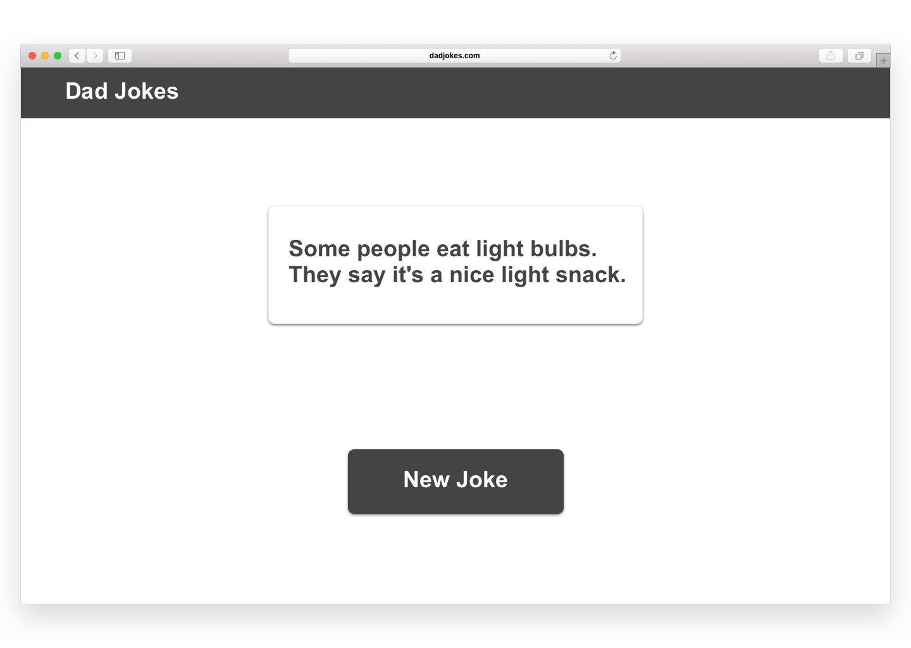

## Starter Code for React API / Fetch Review

_Type_: Codealong/Lab

_Duration_: :45 

_Designed by_: Jeffry Horn / Zakk Fleischman (DC-WDI-React)

### Technologies / Techniques

- React functional components
- props
- useState
- useEffect
- FetchAPI (including setting custom headers)

### Bonus Additions
- lifting state (passing functions through props)
- UI + CSS styling

--- 
## Overview

Your application should make a random dad joke appear when the app loads.

### Goals:
- It should also display a large button that, when clicked, fetches a random dad
joke from the dad jokes API and displays it to the user. 
- Make it look as close to the image provided below.

## Bonus Features

Build a queue that stores the 10 most recently retrieved dad jokes!
Additionally, add some buttons that let you scroll back and forth through the
queue.

You should have:

- One button to get a new joke (append to queue). If there are >10 jokes in the
  queue, drop the oldest one.
- One button to advance to the next joke.
- One button to move to the previous joke.

## Resources

- [A visual guide to useEffect](https://alexsidorenko.com/blog/useeffect/)
- [useEffect + clean ups](https://alexsidorenko.com/blog/useeffect-cleanups/)